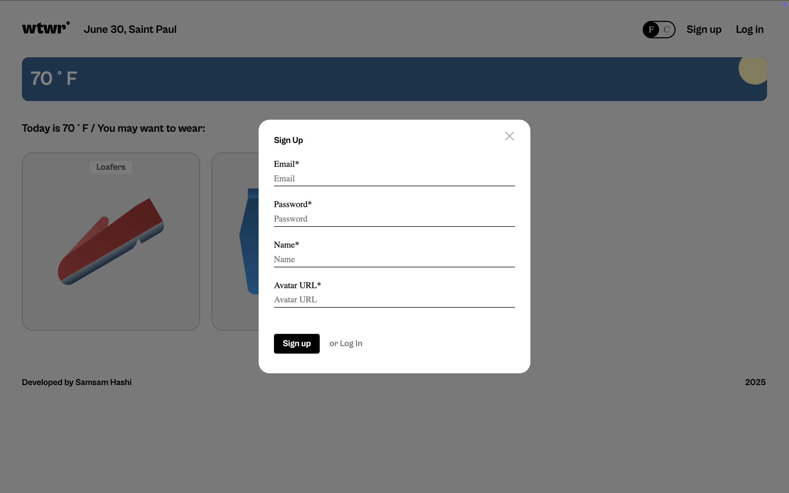
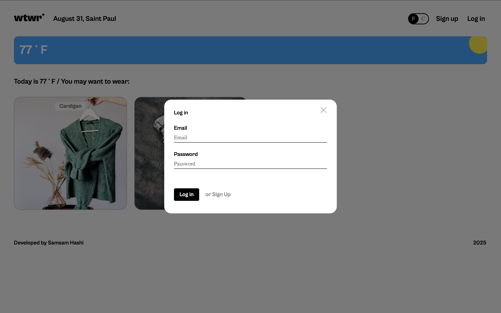
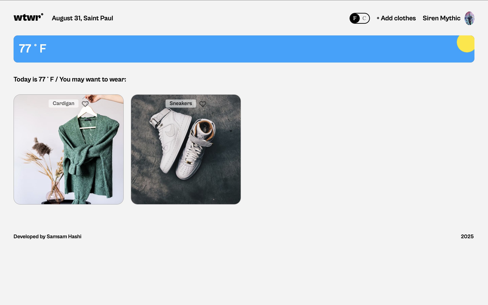
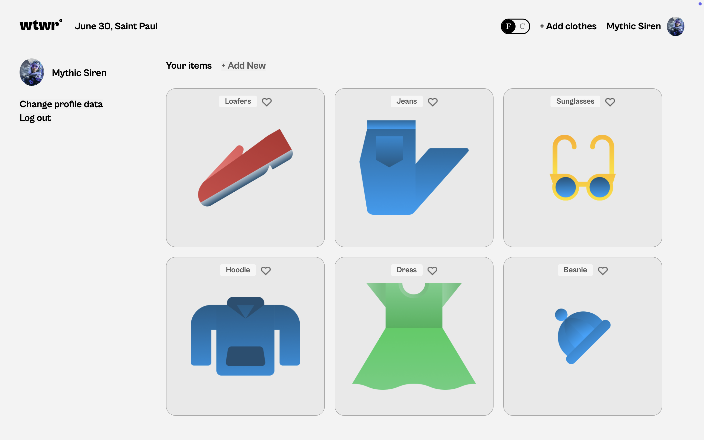
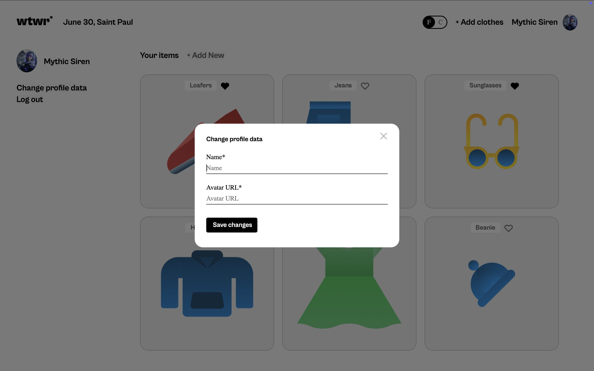

# WTWR (What to Wear?): Full Stack Application

## Table of Contents

- [Project Description](#project-description)
- [Backend Repository](#backend-repository)
- [Project Features](#project-features)
- [Plan for Improving the Project](#plan-for-improving-the-project)
- [Screenshots](#screenshots)
- [Live Demo](#live-demo)
- [Deployment Instructions](#deployment-instructions)
- [System Requirements](#system-requirements)

## Project Description

A full-stack weather-based clothing recommendation app that features user authentication. - A weather app built with React and Vite that displays and updates current weather and tells you what to wear.

## Backend Repository

The backend for this project can be found here: https://github.com/Samjamhas10/se_project_express

## Project Features

- User Authentication(login, register, update profile)
- Clothing recommendation based on current weather API
- Responsive UI
- Updating profile functionality

## Plan for improving the Project

- Fix mobile view using CSS to achieve a more consistent layout and make it more responsive.
- Fix theme toggle using CSS and JavaScript to achieve night and day mode based on user preferences

## Screenshots

## Register



## Login



## Main Route



## Profile Route



## Update Profile



## Live Demo

Deployment link: https://wtwr-app.jumpingcrab.com/

## Deployment Instructions

1. Clone the repository:

   ```bash
   git clone https://github.com/samjamhas10/se_project_react.git
   ```

2. Navigate to project directory:

   `cd se_project_react`

3. Install dependencies

   `npm install`

4. launch the server with the hot reload feature

   `npm run dev`

## System Requirements

- Node.js: v23.11.0 or higher
- npm: 10.9.2v or higher
- Operating system (Linux, macOS, Windows)


