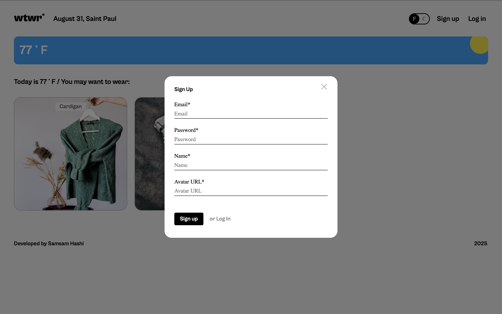

# WTWR (What to Wear?): Full Stack Application

## Table of Contents

- [Project Description](#project-description)
- [Backend Repository](#backend-repository)
- [Project Features](#project-features)
- [Plan for Improving the Project](#plan-for-improving-the-project)
- [Screenshots](#screenshots)
- [Live Demo](#live-demo)
- [Deployment Instructions](#deployment-instructions)
- [System Requirements](#system-requirements)

## Project Description

A full-stack weather-based clothing recommendation app that features user authentication. - A weather app built with React and Vite that displays and updates current weather and tells you what to wear.

## Backend Repository

The backend for this project can be found here: https://github.com/Samjamhas10/se_project_express

## Project Features

**Frontend:**

- React
- CSS
- JSX
- HTML

**Backend:**

- Node.js
- Express.js
- MongoDB
- Mongoose

## Plan for improving the Project

## Screenshots

## Register

## Login

## Main Route

## Profile Route

## Update Profile

## Live Demo

Deployment link: https://samjamhas10.github.io/se_project_react/

## Deployment Instructions

## System Requirements
